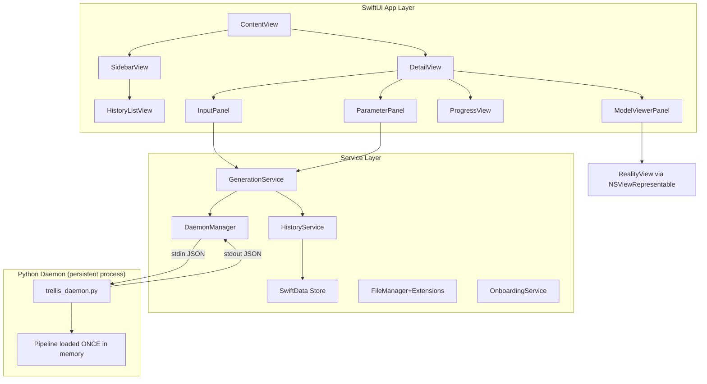

# TRELLIS.2 macOS GUI — Implementation Plan (v2)

**App Name**: Trellis Studio
**Target**: macOS 14+ (Sonoma)
**Distribution**: Direct download (Developer ID signed + notarized), with Sparkle for auto-updates

A native SwiftUI macOS app that wraps the existing TRELLIS.2 pipeline in a premium, polished interface. Users drag in images, tweak parameters, watch real-time progress, preview generated 3D models inline, and manage a history gallery — all from a beautiful Mac-native window.

---

## Resolved Questions (from v1 feedback)

| Question | Decision | Rationale |
|----------|----------|-----------|
| App name | **Trellis Studio** | Professional, matches creative Mac app conventions |
| macOS target | **macOS 14 (Sonoma)** | SwiftData + RealityView native support; 3 years old by now |
| Distribution | **Direct download (DMG)** | Sandbox restrictions block subprocess/venv access; notarize via Developer ID |
| Python bridge | **Persistent stdin/stdout daemon** | Eliminates 103s cold start per generation (see below) |
| 3D viewer | **RealityView (not Model3D)** | Low-level access for wireframe, custom lighting, material manipulation |

---

## Architecture Overview



### Key Architectural Pivot: Persistent Python Daemon

> [!IMPORTANT]
> **Why**: `generate.py` takes ~103s to load the 15GB pipeline into memory. Spawning a fresh subprocess per generation would impose this penalty every time. Instead, we run a persistent daemon that loads the pipeline once and accepts generation requests over stdin/stdout.

**How it works**:
1. On app launch, `DaemonManager` spawns `trellis_daemon.py` as a long-lived `Process`
2. The daemon loads the TRELLIS.2 pipeline into memory once (~103s, shown as a one-time "Warming up" state)
3. For each generation, the Swift app writes a JSON request to the daemon's stdin
4. The daemon streams JSON progress lines back on stdout
5. The daemon stays alive between generations — subsequent requests skip pipeline load entirely (~3m 20s instead of 5m 13s)
6. On app quit, `DaemonManager` sends a `{"command": "shutdown"}` message and terminates the process

**Stdin/stdout protocol**:
```json
// Swift → Python (request)
{"command": "generate", "image": "/path/to/input.png", "seed": 42, "pipeline_type": "512", "texture_size": 1024, "output_dir": "/path/to/output/UUID"}

// Python → Swift (progress, one line per event)
{"stage": "pipeline_load", "status": "done", "elapsed_s": 0}
{"stage": "sparse_structure_sampling", "status": "step", "current": 3, "total": 12}
{"stage": "mesh_extract", "status": "done", "vertices": 412000, "triangles": 824000}
{"stage": "complete", "glb_path": "output.glb", "obj_path": "output.obj", "total_s": 200}

// Error case — watchdog crash
{"stage": "failed", "reason": "watchdog", "message": "GPU watchdog killed Metal kernel..."}

// Shutdown
{"command": "shutdown"}
```

**Critical: Unbuffered I/O** — The daemon must be launched with `PYTHONUNBUFFERED=1` (or `python -u`) so JSON progress lines arrive in real-time, not buffered until process exit.

---

## Proposed Changes

### 1. Xcode Project Setup

#### [NEW] `TrellisStudio.xcodeproj`

- **Bundle ID**: `com.vinware.trellis-studio`
- **Deployment target**: macOS 14.0 (Sonoma)
- **Frameworks**: SwiftUI, RealityKit, UniformTypeIdentifiers, SwiftData
- **Signing**: Developer ID (for notarization + direct distribution)
- **Sandbox**: Disabled (subprocess access + file system reads/writes)
- **Sparkle**: Integrate for self-hosted auto-updates

Location: `GUI/TrellisStudio/`

---

### 2. Design System

#### [NEW] `Theme.swift`

Central design tokens:
- **Color palette**: Deep slate background (`#0F1117`), soft gradient accents (indigo→violet), muted text (`#8B8FA3`), bright white headings
- **Typography**: SF Pro (system) for body, SF Mono for technical readouts (vertex counts, timing)
- **Corner radii**: 12pt cards, 8pt buttons, 20pt panels
- **Glassmorphism**: `.ultraThinMaterial` backgrounds on panels with subtle border strokes
- **Spacing scale**: 4/8/12/16/24/32pt

#### [NEW] `Animations.swift`

Reusable animation constants and view modifiers:
- Smooth spring transitions for panel reveals
- Pulse animation for active generation indicator
- Shimmer effect for loading states

---

### 3. Models (SwiftData)

#### [NEW] `GenerationRecord.swift`

```swift
@Model
class GenerationRecord {
    var id: UUID
    var inputImagePath: String      // App-owned path in Application Support
    var outputGLBPath: String?      // App-owned path in Application Support
    var outputOBJPath: String?
    var thumbnailPath: String?
    var seed: Int
    var pipelineType: String
    var textureSize: Int
    var vertexCount: Int?
    var triangleCount: Int?
    var generationTimeSeconds: Double?
    var createdAt: Date
    var status: GenerationStatus
}
```

> [!NOTE]
> **Asset storage**: All input images are copied to `~/Library/Application Support/com.vinware.trellis-studio/Generations/{UUID}/` on drop. Output GLB/OBJ files are written directly there. This prevents broken references if the user moves/deletes their original files.

#### [NEW] `GenerationStatus.swift`

Enum: `.queued`, `.warmingUp`, `.loadingPipeline`, `.samplingStructure`, `.samplingShape`, `.samplingTexture`, `.decodingShape`, `.decodingTexture`, `.extractingMesh`, `.bakingTexture`, `.complete`, `.failed(String)`, `.failedWatchdog`

#### [NEW] `GenerationParameters.swift`

Observable model holding current UI parameter state (seed, pipeline type, texture size, no-texture flag, custom steps).

---

### 4. Services

#### [NEW] `DaemonManager.swift` (replaces `ProcessRunner.swift`)

Manages the persistent `trellis_daemon.py` subprocess lifecycle:
- Spawns daemon on app launch with correct environment:
  - `PATH` including `.venv/bin`
  - `PYTORCH_ENABLE_MPS_FALLBACK=1`
  - `PYTHONUNBUFFERED=1`
  - `HF_TOKEN` from user settings (if set)
  - `SPARSE_CONV_BACKEND` from user settings
- Monitors daemon health (restart on unexpected crash)
- Provides `sendRequest(_:) -> AsyncStream<DaemonProgress>` API
- Sends `{"command": "shutdown"}` on app termination
- Monitors `Process.terminationHandler` for exit code 2 (watchdog crash)

#### [NEW] `GenerationService.swift`

Orchestrates the generation workflow:
- Validates input image
- **Copies input to app-owned `Application Support` directory** (not temp)
- Checks free disk space before first generation (~15GB for weights + output)
- Sends request to `DaemonManager`
- Listens to progress stream and updates `GenerationRecord` in SwiftData
- Detects thermal throttling: if elapsed time exceeds 2× historical average for current stage, surfaces a "throttling" warning
- **Strict serial queue** for generation — no concurrent generations (24GB memory constraint would OOM)

#### [NEW] `HistoryService.swift`

CRUD operations on `GenerationRecord` via SwiftData:
- Fetch all records sorted by date
- Delete records (and their output files from Application Support)
- Export/share individual outputs (copy to user-chosen location)

#### [NEW] `OnboardingService.swift`

First-launch and prerequisite checks:
- **HuggingFace token**: Prompt for HF token on first launch, validate it, store in Keychain. Set `HF_TOKEN` env var for daemon.
- **Trellis installation path**: Auto-detect or prompt user to locate the repo directory containing `generate.py` and `.venv`
- **Disk space check**: Verify ≥15GB free before first generation (weights download)
- **Setup validation**: Verify `.venv/bin/python` exists, `generate.py` is present

#### [NEW] `SettingsService.swift`

Persists user preferences via `@AppStorage` + Keychain:
- Trellis installation path
- Default parameters
- HuggingFace token (Keychain)
- Environment variable overrides

---

### 5. Views — Main Layout

#### [NEW] `TrellisStudioApp.swift`

App entry point. Configures SwiftData `ModelContainer`, injects services into environment. Triggers `OnboardingService` checks on first launch.

#### [NEW] `ContentView.swift`

`NavigationSplitView` with:
- **Sidebar** (280pt): History gallery list
- **Detail** (flexible): Main workspace
- Daemon status indicator in toolbar (🟢 ready / 🟡 warming up / 🔴 offline)

#### [NEW] `SidebarView.swift`

- Search/filter bar at top
- Scrollable list of `HistoryRowView` items
- "New Generation" button (prominent, gradient accent)
- Batch mode toggle

---

### 6. Views — Input & Parameters

#### [NEW] `InputPanel.swift`

- Large drop zone (dashed border, animated on hover) for image drag-and-drop
- Accepts `.png`, `.jpg`, `.jpeg`, `.webp`, `.heic`
- Shows image preview with filename + dimensions after drop
- "Browse..." button as alternative to drag
- Remove / replace image button

#### [NEW] `ParameterPanel.swift`

Glassmorphic card with:
- **Seed**: Text field with 🎲 randomize button
- **Pipeline Type**: Segmented picker (`512` / `1024` / `1024 Cascade`)
- **Texture Size**: Segmented picker (`512` / `1024` / `2048`)
- **No Texture**: Toggle switch
- **Steps Override**: Optional stepper (disabled by default)
- **Presets**: Quick-apply buttons ("Fast Draft", "Balanced", "Max Quality")
- "Generate" CTA button — large, gradient, with keyboard shortcut ⌘G

---

### 7. Views — Progress

#### [NEW] `GenerationProgressView.swift`

Appears during generation:
- Vertical stepper showing all pipeline stages with checkmarks/spinner
- Current stage highlighted with animated indicator
- Elapsed time counter
- Estimated time remaining (based on historical averages from SwiftData)
- **Thermal throttle warning**: Subtle amber banner if current stage is taking >2× the historical average — *"Generation is slower than usual. Your Mac may be thermally throttled."*
- Cancel button
- Stage details: vertex count, face count as they become available

---

### 8. Views — 3D Model Viewer

#### [NEW] `ModelViewerPanel.swift`

Uses **`RealityView`** (not `Model3D`) via `NSViewRepresentable` for full rendering control:
- Loads the generated `.glb` as a RealityKit `Entity`
- Orbit, zoom, pan camera controls
- **Environment lighting toggle**: Swap `ImageBasedLightComponent` (studio / outdoor / neutral)
- **Wireframe overlay toggle**: Apply custom wireframe material to entity
- Background toggle (transparent / gradient / solid)
- Stats overlay: vertex count, triangle count, file size
- Export buttons: "Reveal in Finder", "Share", "Open in Preview"

---

### 9. Views — History & Gallery

#### [NEW] `HistoryRowView.swift`

Compact row for sidebar:
- Thumbnail of input image (40×40, rounded) — loaded from app-owned path
- Truncated filename
- Status badge (✓ complete / ⏳ generating / ✕ failed / ⚠️ watchdog)
- Relative timestamp ("2 min ago")

#### [NEW] `HistoryDetailView.swift`

Full detail view when a history item is selected:
- Side-by-side: input image ↔ 3D model viewer
- Generation parameters used
- Timing breakdown
- Re-generate with same/modified parameters button
- Delete button (removes files from Application Support)

---

### 10. Views — Batch Processing

#### [NEW] `BatchQueueView.swift`

- Drag multiple images at once
- Grid of queued items with individual status indicators
- Progress bar for overall batch
- Shared parameter controls applied to all items
- **Strictly serial execution** — one generation at a time (24GB memory constraint)
- Pause / Resume / Cancel all

---

### 11. Views — Onboarding & Error Handling

#### [NEW] `OnboardingView.swift`

First-launch wizard:
1. **Welcome**: App introduction
2. **Locate Trellis**: Auto-detect or browse for the trellis-mac installation directory
3. **HuggingFace Token**: Text field to paste HF token, with link to get one. Validates token before proceeding.
4. **Disk Space**: Shows available space, warns if <15GB
5. **Ready**: Summary + "Launch" button that starts the daemon

#### [NEW] `WatchdogErrorSheet.swift`

Modal sheet shown when daemon exits with code 2 or sends `{"reason": "watchdog"}`:
- Explains the GPU watchdog issue in plain language
- Lists workarounds:
  1. Close lid / unplug displays, run headless via SSH
  2. Set `MTL_CAPTURE_ENABLED=1` (available as a toggle in Advanced Settings)
  3. Try `SPARSE_CONV_BACKEND=none`
- "Retry" and "Open Settings" buttons

---

### 12. Python Daemon (New File)

#### [NEW] `trellis_daemon.py`

Replaces direct `generate.py` subprocess calls. A persistent stdin/stdout daemon:
- On startup: loads the TRELLIS.2 pipeline once, emits `{"stage": "pipeline_load", "status": "done"}`
- Enters `while True` loop reading JSON requests from stdin
- For each `generate` request: runs the generation pipeline, emits progress JSON lines
- Handles `shutdown` command gracefully
- Catches watchdog errors (exit code 2 signatures) and emits `{"stage": "failed", "reason": "watchdog"}`
- All output uses `sys.stdout.flush()` after every line (belt-and-suspenders with `PYTHONUNBUFFERED=1`)

> [!NOTE]
> `generate.py` remains unchanged as the standalone CLI tool. `trellis_daemon.py` is a new file that reuses the same pipeline loading and generation logic but wraps it in a persistent request loop.

---

### 13. Settings & Preferences

#### [NEW] `SettingsView.swift`

macOS Settings window (⌘,):
- **General**: Trellis installation path (folder picker), output directory
- **Account**: HuggingFace token (stored in Keychain), validation status
- **Defaults**: Default seed, pipeline type, texture size
- **Appearance**: Dark mode (always dark / system)
- **Advanced**: Environment variable overrides (`SPARSE_CONV_BACKEND`, `MTL_CAPTURE_ENABLED`, etc.)

---

## File Tree Summary

```
GUI/TrellisStudio/
├── TrellisStudioApp.swift              — App entry, SwiftData container
├── Theme/
│   ├── Theme.swift                     — Colors, typography, spacing tokens
│   └── Animations.swift                — Shared animation modifiers
├── Models/
│   ├── GenerationRecord.swift          — SwiftData model (app-owned paths)
│   ├── GenerationStatus.swift          — Status enum (incl. watchdog)
│   └── GenerationParameters.swift      — Observable parameter state
├── Services/
│   ├── DaemonManager.swift             — Persistent Python daemon lifecycle
│   ├── GenerationService.swift         — Generation orchestration (serial queue)
│   ├── HistoryService.swift            — SwiftData CRUD
│   ├── OnboardingService.swift         — First-launch checks (HF token, disk, path)
│   └── SettingsService.swift           — UserDefaults/Keychain persistence
├── Views/
│   ├── ContentView.swift               — NavigationSplitView layout
│   ├── SidebarView.swift               — History sidebar
│   ├── InputPanel.swift                — Image drop zone
│   ├── ParameterPanel.swift            — Generation controls + presets
│   ├── GenerationProgressView.swift    — Live stage progress + throttle warning
│   ├── ModelViewerPanel.swift          — RealityView 3D viewer
│   ├── HistoryRowView.swift            — Sidebar row
│   ├── HistoryDetailView.swift         — Full history detail
│   ├── BatchQueueView.swift            — Batch processing UI (serial)
│   ├── OnboardingView.swift            — First-launch wizard
│   ├── WatchdogErrorSheet.swift        — GPU watchdog error modal
│   └── SettingsView.swift              — Preferences window
└── Assets.xcassets/                    — App icon, accent colors

trellis_daemon.py                       — Persistent Python daemon (new, at repo root)
```

---

## Verification Plan

### Build & Run
- Project compiles without warnings on Xcode 16+ / macOS 14+
- App launches and displays the main window
- Daemon spawns and reaches "ready" state

### Automated Tests
```bash
xcodebuild test -scheme TrellisStudio -destination 'platform=macOS'
```

Unit tests for:
- `DaemonManager` JSON parsing logic (mock stdin/stdout)
- `GenerationParameters` default values and presets
- `GenerationStatus` transitions
- `HistoryService` CRUD operations (in-memory SwiftData container)
- `OnboardingService` validation checks (mock filesystem)

### Manual Verification
- First launch → onboarding wizard appears, validates HF token and path
- Daemon warms up → toolbar shows 🟢 ready
- Drag an image → preview appears, copied to Application Support
- Adjust parameters → Generate button works
- Progress view shows each stage updating in real-time (no buffering lag)
- Generated GLB loads in RealityView with orbit/zoom/wireframe toggle
- History sidebar populates with past generations
- Delete a history item → files removed from Application Support
- Batch mode: queue 3 images, all process serially (not concurrent)
- Simulate watchdog crash → error sheet with workarounds appears
- Settings window saves and restores preferences + HF token
- App quit → daemon shuts down cleanly
