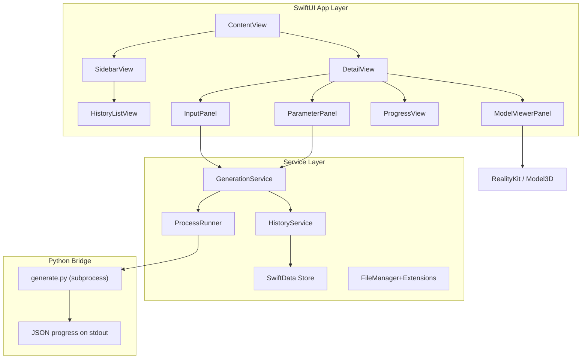

# TRELLIS.2 macOS GUI — Implementation Plan

A native SwiftUI macOS app that wraps the existing `generate.py` CLI in a premium, polished interface. Users drag in images, tweak parameters, watch real-time progress, preview generated 3D models inline, and manage a history gallery — all from a beautiful Mac-native window.

---

## User Review Required

> [!IMPORTANT]
> **Python bridge strategy**: The GUI shells out to `generate.py` as a subprocess (via `Process`), parsing its stdout for stage progress. This avoids embedding Python in the app and keeps the ML stack decoupled. The trade-off is that we rely on the existing CLI output format for progress — we'll add lightweight JSON progress markers to `generate.py` so the GUI can parse structured updates. Is this acceptable, or would you prefer a different integration approach (e.g., a local HTTP server)?

> [!IMPORTANT]
> **3D Viewer**: SceneKit can load `.obj` files natively, but for full PBR GLB support we'll use Apple's `RealityKit` (via `ModelEntity.load`) or the `Model3D` view introduced in macOS 14. This gives us orbit, zoom, and pan out of the box. Do you want to target macOS 14+ (Sonoma) to use the native `Model3D` SwiftUI view, or support macOS 13 with a SceneKit fallback?

> [!WARNING]
> **Virtual environment path**: The app needs to know where the `.venv` and `generate.py` live. We'll default to the repo directory (auto-detected or user-configured in Settings). First launch will prompt the user to locate their trellis-mac installation if not found.

## Open Questions

1. **App name**: "Trellis Studio"? "Trellis 3D"? Or something else?
2. **Minimum macOS target**: macOS 14 (Sonoma) for native `Model3D` view, or macOS 13 (Ventura) with SceneKit fallback?
3. **Distribution**: Will this be distributed via the Mac App Store, direct download, or just built locally from Xcode?

---

## Architecture Overview



---

## Proposed Changes

### 1. Xcode Project Setup

#### [NEW] `TrellisStudio.xcodeproj`

Create a new macOS SwiftUI app target:
- **Bundle ID**: `com.vinware.trellis-studio`
- **Deployment target**: macOS 14.0 (Sonoma)
- **Frameworks**: SwiftUI, RealityKit, UniformTypeIdentifiers, SwiftData
- **Signing**: Development team signing
- **Sandbox**: Disabled (needs subprocess access + file system reads/writes)

Location: `/Users/vincentdeaugustine/VinWareLLC/trellis-mac-gui/GUI/TrellisStudio/`

---

### 2. Design System

#### [NEW] `Theme.swift`

Central design tokens:
- **Color palette**: Deep slate background (`#0F1117`), soft gradient accents (indigo→violet), muted text (`#8B8FA3`), bright white headings
- **Typography**: SF Pro (system) for body, SF Mono for technical readouts (vertex counts, timing)
- **Corner radii**: 12pt cards, 8pt buttons, 20pt panels
- **Glassmorphism**: `.ultraThinMaterial` backgrounds on panels with subtle border strokes
- **Spacing scale**: 4/8/12/16/24/32pt

#### [NEW] `Animations.swift`

Reusable animation constants and view modifiers:
- Smooth spring transitions for panel reveals
- Pulse animation for active generation indicator
- Shimmer effect for loading states

---

### 3. Models (SwiftData)

#### [NEW] `GenerationRecord.swift`

```swift
@Model
class GenerationRecord {
    var id: UUID
    var inputImagePath: String
    var outputGLBPath: String?
    var outputOBJPath: String?
    var thumbnailPath: String?
    var seed: Int
    var pipelineType: String
    var textureSize: Int
    var vertexCount: Int?
    var triangleCount: Int?
    var generationTimeSeconds: Double?
    var createdAt: Date
    var status: GenerationStatus
}
```

#### [NEW] `GenerationStatus.swift`

Enum: `.queued`, `.loadingPipeline`, `.samplingStructure`, `.samplingShape`, `.samplingTexture`, `.decodingShape`, `.decodingTexture`, `.extractingMesh`, `.bakingTexture`, `.complete`, `.failed(String)`

#### [NEW] `GenerationParameters.swift`

Observable model holding current UI parameter state (seed, pipeline type, texture size, no-texture flag, custom steps).

---

### 4. Services

#### [NEW] `ProcessRunner.swift`

Wraps `Foundation.Process` to run `generate.py`:
- Configures environment (`PATH` to `.venv/bin`, `PYTORCH_ENABLE_MPS_FALLBACK=1`)
- Streams stdout line-by-line via `Pipe` + `FileHandle.readabilityHandler`
- Parses JSON progress markers emitted by the modified `generate.py`
- Publishes progress updates via an `AsyncStream<GenerationProgress>`
- Supports cancellation (`process.terminate()`)

#### [NEW] `GenerationService.swift`

Orchestrates the generation workflow:
- Validates input image
- Copies input to a working directory
- Launches `ProcessRunner`
- Listens to progress stream and updates `GenerationRecord` in SwiftData
- On completion, reads output paths and updates the record
- Manages a serial queue for single-generation execution, plus a batch queue for multi-image processing

#### [NEW] `HistoryService.swift`

CRUD operations on `GenerationRecord` via SwiftData:
- Fetch all records sorted by date
- Delete records (and their output files)
- Export/share individual outputs

#### [NEW] `SettingsService.swift`

Persists user preferences via `@AppStorage`:
- Trellis installation path
- Default parameters
- Theme preference (auto/dark)

---

### 5. Views — Main Layout

#### [NEW] `TrellisStudioApp.swift`

App entry point. Configures SwiftData `ModelContainer`, injects services into environment.

#### [NEW] `ContentView.swift`

`NavigationSplitView` with:
- **Sidebar** (280pt): History gallery list
- **Detail** (flexible): Main workspace

#### [NEW] `SidebarView.swift`

- Search/filter bar at top
- Scrollable list of `HistoryRowView` items
- "New Generation" button (prominent, gradient accent)
- Batch mode toggle

---

### 6. Views — Input & Parameters

#### [NEW] `InputPanel.swift`

- Large drop zone (dashed border, animated on hover) for image drag-and-drop
- Accepts `.png`, `.jpg`, `.jpeg`, `.webp`, `.heic`
- Shows image preview with filename + dimensions after drop
- "Browse..." button as alternative to drag
- Remove / replace image button

#### [NEW] `ParameterPanel.swift`

Glassmorphic card with:
- **Seed**: Text field with 🎲 randomize button
- **Pipeline Type**: Segmented picker (`512` / `1024` / `1024 Cascade`)
- **Texture Size**: Segmented picker (`512` / `1024` / `2048`)
- **No Texture**: Toggle switch
- **Steps Override**: Optional stepper (disabled by default)
- **Presets**: Quick-apply buttons ("Fast Draft", "Balanced", "Max Quality")
- "Generate" CTA button — large, gradient, with keyboard shortcut ⌘G

---

### 7. Views — Progress

#### [NEW] `GenerationProgressView.swift`

Appears during generation:
- Vertical stepper showing all pipeline stages with checkmarks/spinner
- Current stage highlighted with animated indicator
- Elapsed time counter
- Estimated time remaining (based on historical averages)
- Cancel button
- Stage details: vertex count, face count as they become available

---

### 8. Views — 3D Model Viewer

#### [NEW] `ModelViewerPanel.swift`

Uses `Model3D` (macOS 14+) or `RealityView`:
- Loads the generated `.glb` file
- Orbit, zoom, pan camera controls
- Environment lighting toggle (studio / outdoor / neutral)
- Wireframe overlay toggle
- Background toggle (transparent / gradient / solid)
- Stats overlay: vertex count, triangle count, file size
- Export buttons: "Reveal in Finder", "Share", "Open in Preview"

---

### 9. Views — History & Gallery

#### [NEW] `HistoryRowView.swift`

Compact row for sidebar:
- Thumbnail of input image (40x40, rounded)
- Truncated filename
- Status badge (✓ complete / ⏳ generating / ✕ failed)
- Relative timestamp ("2 min ago")

#### [NEW] `HistoryDetailView.swift`

Full detail view when a history item is selected:
- Side-by-side: input image ↔ 3D model viewer
- Generation parameters used
- Timing breakdown
- Re-generate with same/modified parameters button
- Delete button

---

### 10. Views — Batch Processing

#### [NEW] `BatchQueueView.swift`

- Drag multiple images at once
- Grid of queued items with individual status indicators
- Progress bar for overall batch
- Shared parameter controls applied to all items
- Pause / Resume / Cancel all

---

### 11. Python Bridge Modifications

#### [MODIFY] [generate.py](file:///Users/vincentdeaugustine/VinWareLLC/trellis-mac-gui/generate.py)

Add a `--json-progress` flag that, when set, emits structured JSON lines to stdout alongside (or instead of) the human-readable output. This lets the Swift `ProcessRunner` parse progress reliably:

```json
{"stage": "pipeline_load", "status": "start"}
{"stage": "pipeline_load", "status": "done", "elapsed_s": 103}
{"stage": "sparse_structure_sampling", "status": "start", "steps": 12}
{"stage": "sparse_structure_sampling", "status": "step", "current": 3, "total": 12}
{"stage": "sparse_structure_sampling", "status": "done", "elapsed_s": 80}
{"stage": "mesh_extract", "status": "done", "vertices": 412000, "triangles": 824000}
{"stage": "texture_bake", "status": "start", "size": 1024}
{"stage": "complete", "glb_path": "output_3d.glb", "obj_path": "output_3d.obj", "total_s": 313}
```

Changes are additive — the flag is opt-in, existing CLI behavior is unchanged.

---

### 12. Settings & Preferences

#### [NEW] `SettingsView.swift`

macOS Settings window (⌘,):
- **General**: Trellis installation path (folder picker), output directory
- **Defaults**: Default seed, pipeline type, texture size
- **Appearance**: Dark mode (always dark / system)
- **Advanced**: Environment variable overrides (`SPARSE_CONV_BACKEND`, etc.)

---

## File Tree Summary

```
GUI/TrellisStudio/
├── TrellisStudioApp.swift          — App entry, SwiftData container
├── Theme/
│   ├── Theme.swift                 — Colors, typography, spacing tokens
│   └── Animations.swift            — Shared animation modifiers
├── Models/
│   ├── GenerationRecord.swift      — SwiftData model
│   ├── GenerationStatus.swift      — Status enum
│   └── GenerationParameters.swift  — Observable parameter state
├── Services/
│   ├── ProcessRunner.swift         — Subprocess bridge to generate.py
│   ├── GenerationService.swift     — Generation orchestration
│   ├── HistoryService.swift        — SwiftData CRUD
│   └── SettingsService.swift       — UserDefaults/AppStorage
├── Views/
│   ├── ContentView.swift           — NavigationSplitView layout
│   ├── SidebarView.swift           — History sidebar
│   ├── InputPanel.swift            — Image drop zone
│   ├── ParameterPanel.swift        — Generation controls
│   ├── GenerationProgressView.swift — Live stage progress
│   ├── ModelViewerPanel.swift      — 3D GLB viewer
│   ├── HistoryRowView.swift        — Sidebar row
│   ├── HistoryDetailView.swift     — Full history detail
│   ├── BatchQueueView.swift        — Batch processing UI
│   └── SettingsView.swift          — Preferences window
└── Assets.xcassets/                — App icon, accent colors
```

---

## Verification Plan

### Build & Run
- Project compiles without warnings on Xcode 16+ / macOS 14+
- App launches and displays the main window

### Automated Tests
```bash
xcodebuild test -scheme TrellisStudio -destination 'platform=macOS'
```

Unit tests for:
- `ProcessRunner` JSON parsing logic (mock stdout)
- `GenerationParameters` default values and presets
- `GenerationStatus` transitions
- `HistoryService` CRUD operations (in-memory SwiftData container)

### Manual Verification
- Drag an image → preview appears
- Adjust parameters → Generate button works
- Progress view shows each stage updating in real-time
- Generated GLB loads in the 3D viewer with orbit/zoom
- History sidebar populates with past generations
- Batch mode: queue 3 images, all process sequentially
- Settings window saves and restores preferences
- App looks premium: glassmorphic panels, smooth animations, dark theme
